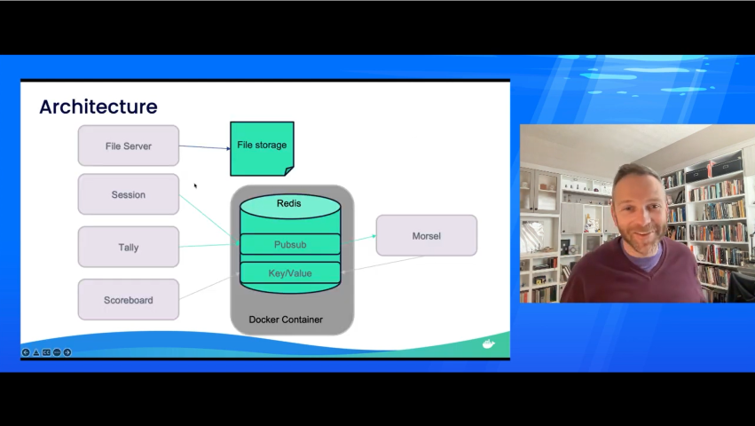

# explore-wasi

A repository to explore [WebAssembly System Interface (WASI)](https://github.com/bytecodealliance/wasmtime/blob/main/docs/WASI-intro.md).

## Development Tools

This repository specifies a Visual Studio Code [devcontainer.json](.devcontainer/devcontainer.json) and [Docker image](.devcontainer/Dockerfile) that gives you all the prerequisites and preview versions of software you need to begin building and running WebAssembly binaries in dotnet, Rust, and Go with the [wasmtime runtime](https://github.com/bytecodealliance/wasmtime).

It's very easy to [open this repository in a GitHub CodeSpace](https://docs.github.com/en/codespaces/developing-in-codespaces/creating-a-codespace#creating-a-codespace), otherwise [follow these instructions to open this repository in a DevContainer locally](https://code.visualstudio.com/docs/remote/containers).

## What's in this repository

- [dotnet](./src/dotnet/README.md) -- a simple .NET 7 WebAssembly module
- [rust](./src/rust/README.md) -- a Rust WebAssembly module that copies files

## Context

This repository is largely inspired by this video from Matt Butcher from Fermyon that highlights how WebAssembly modules are an attractive path to developing and deploying fast, cross-platform, and secure microservices:

