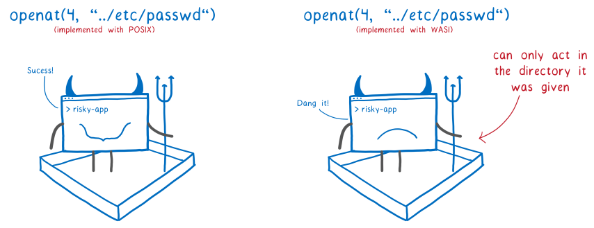

# rust

This directory contains a Rust file-cloning application using the experimental [`wasm32-wasi`](https://doc.rust-lang.org/nightly/nightly-rustc/rustc_target/spec/wasm32_wasi/index.html) target definition. It builds a WebAssembly binary (.wasm) to demonstrate WASI's sandboxing capabilites.

[](https://hacks.mozilla.org/2019/03/standardizing-wasi-a-webassembly-system-interface/)

This is largely a reference of this [WASI tutorial](https://github.com/bytecodealliance/wasmtime/blob/89abd80c3cc4ed549bc3a2b0fd864ccc1af06ad6/docs/WASI-tutorial.md) from bytecodealliance, authors of the `wasmtime` runtime.

## Development Tools

The tools you need for this project are bundled in a DevContainer.

See the [root README](../../README.md#development-tools) for instructions on opening this project.

## Building the WebAssembly Binary

To build a `.wasm` binary, the application targets the experimental [`wasm32-wasi`](https://doc.rust-lang.org/nightly/nightly-rustc/rustc_target/spec/wasm32_wasi/index.html) target.

1. Let's inspect the application

    ```plaintext
    cd wasi_app
    ```

1. The build target was added to the application:

    ```plaintext
    rustup target add wasm32-wasi
    ```

1. Which, for reference, adds the `wasi_app` package to the application's [`Cargo.toml`](./wasi_app/Cargo.toml) manifest:

    ```toml
    [package]
    name = "wasi_app"
    version = "0.1.0"
    edition = "2021"
    ```

1. Then, it's simply `cargo build` while specifying that target:

    ```plaintext
    cargo build --target wasm32-wasi
    ```

1. And it builds the `.wasm` binary for us at `target/wasm32-wasi/debug`:

    ```plaintext
    file target/wasm32-wasi/debug/wasi_app.wasm
    ```

## Run the app

We can run the `.wasm` binary with the `wasmtime` runtime.

1. Navigate to the directory where the app was built:

    ```plaintext
    cd target/wasm32-wasi/debug
    ```

1. The application is a file-cloner, so let's create a source file for it to clone:

    ```plaintext
    echo "Hello, World!" > test.txt
    ```

1. Try to run the application with `wasmtime`:

    ```plaintext
    wasmtime wasi_app.wasm test.txt /tmp/test.txt
    ```

1. Oops, we should receive an error:

    ```plaintext
    error opening input file test.txt: failed to find a pre-opened file descriptor through which "test.txt" could be opened
    ```

    We receive this error from WebAssembly's sandboxing! Our program is attempting to access `test.txt`, but has not been given the capability to do so.

    Notice our application did not have to anything at all to get this capability, it was all handled by the host that invoked the application. Pretty nifty.

1. Let's give our application the capability to access the files we need it to:

    ```plaintext
    wasmtime --dir=. --dir=/tmp wasi_app.wasm test.txt /tmp/test.txt
    ```

1. And, just for good measure, we can inspect the contents of our destination file:

    ```plaintext
    cat /tmp/test.txt
    ```

1. And see our expected result:

    ```plaintext
    Hello, World!
    ```
