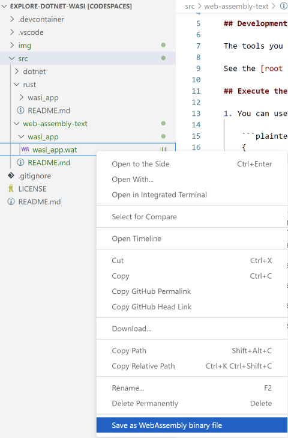

# web-assembly-text

In this directory is a WebAssembly text format application that prints `hello world` to demonstrate that WebAssembly can be written in a human-readable format as well as converted back-and-forth from a text file to a binary using the [WebAssembly Visual Studio Code Extension](https://marketplace.visualstudio.com/items?itemName=dtsvet.vscode-wasm).

You could use the `wat2wasm` or `wasm2wat` tools from the [`wabt` toolkit](https://github.com/WebAssembly/wabt) (pronounced "wabbit") to perform these conversions, but that would require building them from source. The Visual Studio Code extension makes this effort much easier.

## Development Tools

The tools you need for this project are bundled in a DevContainer.

See the [root README](../../README.md#development-tools) for instructions on opening this project.

## Execute the WebAssembly text file

1. You can use `wasmtime` can directly execute `.wat` files:

    ```plaintext
    wasmtime wasi_app/wasi_app.wat
    ```

1. And you'll receive the output:

    ```plaintext
    hello world
    ```

## Building the WebAssembly Binary

Or, you can use the [WebAssembly Visual Studio Code Extension](https://marketplace.visualstudio.com/items?itemName=dtsvet.vscode-wasm) to generate a binary too.

1. Right-click the `wasi_app.wat` text file and select `Save as WebAssembly binary file`:

    [](https://marketplace.visualstudio.com/items?itemName=dtsvet.vscode-wasm)

1. Run the resulting `wasi_app.wasm` binary with `wasmtime`:

    ```plaintext
    wasmtime wasi_app/wasi_app.wasm
    ```

1. And you'll receive the same output:

    ```plaintext
    hello world
    ```
